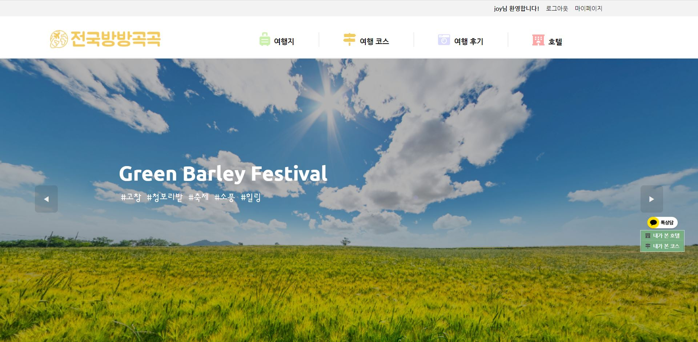
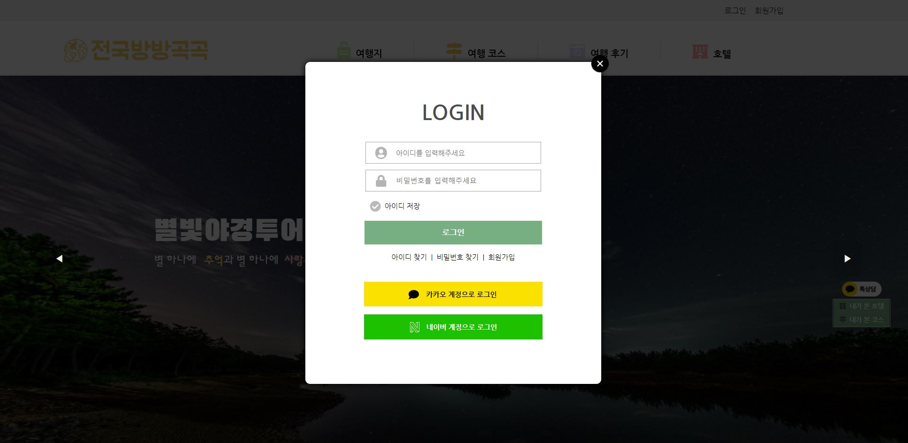
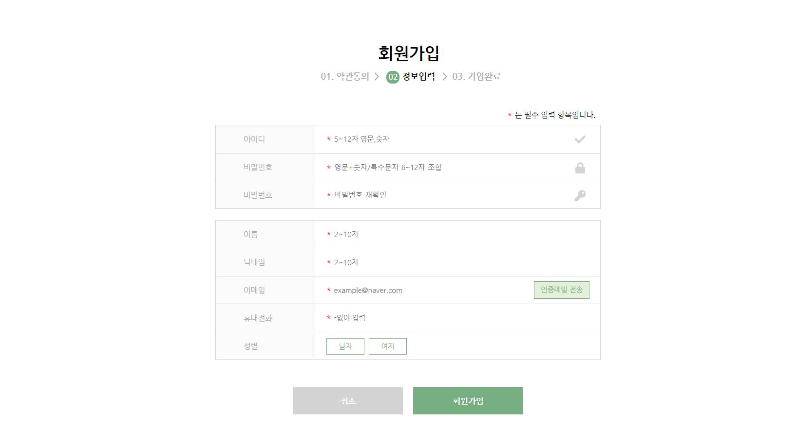
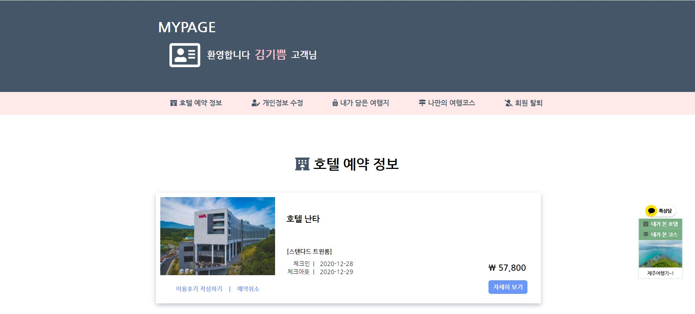
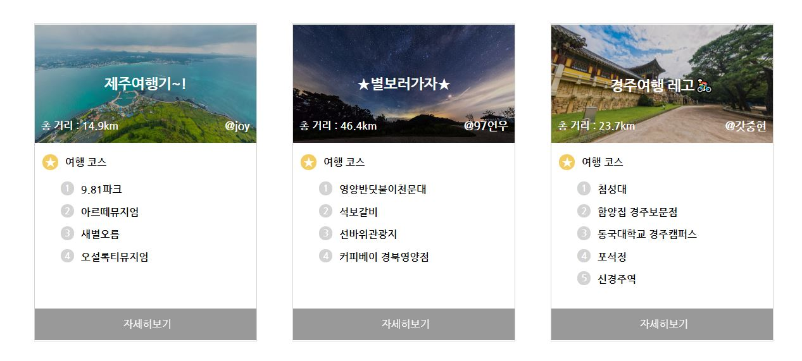
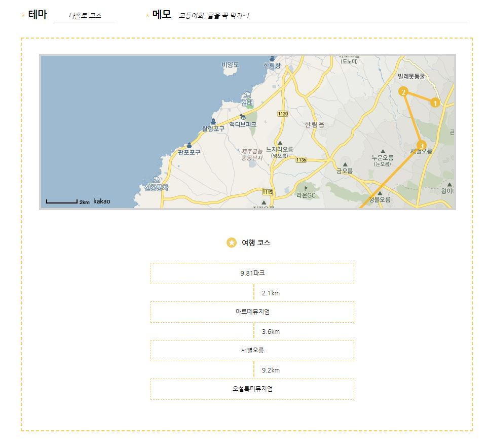
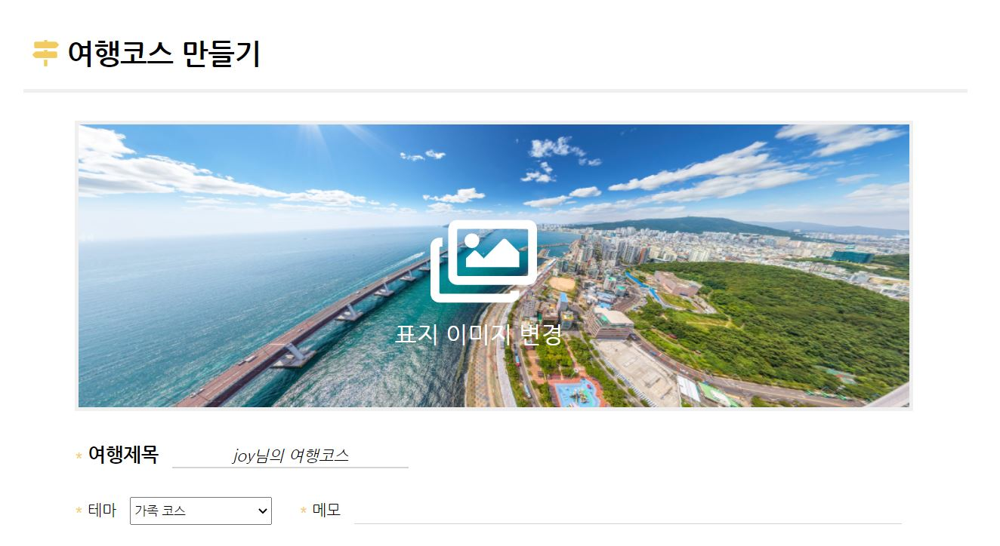
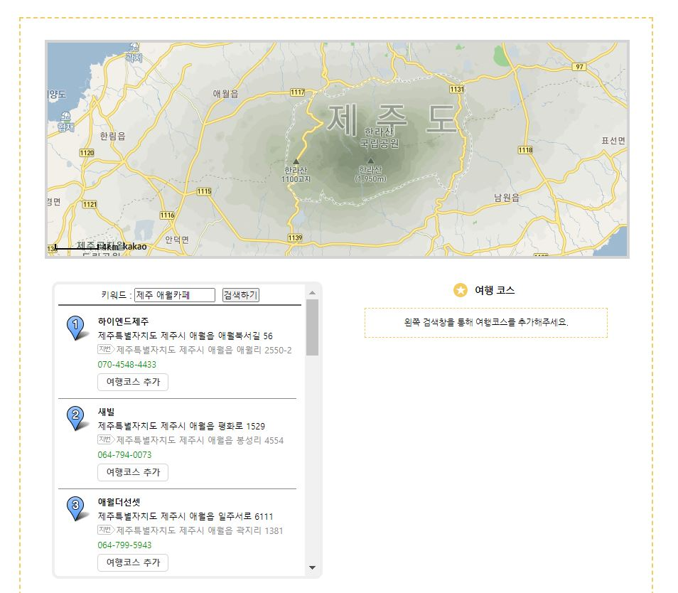

# :world_map: TRIP2REAP (국내 여행정보 웹사이트)
### 20.09.21 ~ 20.12.21

:ok_person: &nbsp; 팀장 : 김기쁨 
:family_woman_woman_girl_girl: 팀원 : 김수진, 이규호, 최은강

#

:globe_with_meridians: 개발환경
- Server : Apache Tomcat 9.0
- Database : Oracle 11g
- Development Tool : Eclipse 4.15.0, sqlDeveloper version 19.2.1.247, Apache Maven
- Development Language :  JAVA , HTML5, CSS3, JavaScript, jQuery, SQL, JSP
- Web Framework: spring, Mybatis
- Team Coop : Github, ERDCloud, kakaoOven
- API: Swal, Swipper, kakao map, kakao login, naver login, SMTP, I'mport

#

  :pencil2: 개요                                  
  포스트 코로나시대의 관광개발과 향후 전망 통계에 따르면 앞으로 국내여행자의 규모와 국내 숙소 이용률도 증가할 것이라고 합니다.  
  국내 여행 정보를 제공함과 동시에 숙소 예약 서비스까지 제공할 수 있는 사이트를 만들면 어떨까? 라는 생각으로  
  국내여행사이트 “전국방방곡곡”을 개발하게 되었습니다
  
 
#

:calendar: 일정
- 9/21 ~ 9/25 기획회의 
- 9/26 ~ 10/1  UI설계회의 
- 10/2  ~ 10/5  DB설계회의(테이블 설계, 구축) 
- 10/13 ~ 11/8 UI 구현
- 11/9 ~ 12/15  기능구현
- 12/16  ~ 12/21 통합테스트  

### :raising_hand: 맡은 파트

:yellow_heart: 기쁨 
 - 로그인(일반 로그인, 카카오 로그인, 네이버 로그인) / 로그아웃 
 - 회원가입 / 아이디 찾기 / 비밀번호 찾기 / 아이디 저장 
 - 마이페이지(호텔예약정보 / 개인정보 수정 / 내가 담은 여행지 / 나만의 여행코스 / 회원탈퇴)
 - 여행코스 게시판 조회 / 등록 / 삭제
 - 메인페이지  

:purple_heart: 수진
- 여행지 게시판 조회 / 등록 / 수정 / 삭제 
- 카테고리 검색
- 해시태그 등록 / 수정 / 삭제 / 검색  

:green_heart: 규호
- 여행후기 게시판 조회 / 등록 / 수정 / 삭제
- 카테고리 검색
- 해시태그 검색
- 댓글 등록 / 수정 / 삭제  

 

:orange_heart: 은강
- 호텔 조회 / 등록 / 삭제
- 리뷰 등록 / 삭제
- 호텔 예약  
- 리모컨(조회한 호텔/코스 리스트)

#

:star: 설계 주안점
- 카카오톡 로그인, 네이버 로그인 API를 사용하여, 회원가입 없이도 사용자가 서비스를 이용할 수 있도록 하였다(편리성, 접근성 증가)
- 비밀번호 암호화를 통해 보안을 강화시켰다.
- 정규표현식을 사용하여 사용자가 입력한 정보에 대해 정해진 식에 맞춰 입력해야 회원가입이 될 수 있도록 있도록  유효성 검사를 하였다.
- 일부 기능은 비동기방식으로, 화면전환이 아닌 한페이지 내에서 동작할 수 있게 하였다.
- MyBatis 동적SQL문을 이용하여 사용자가 원하는 조건의 호텔 검색이 가능하게 하였다.
- 카카오 맵 API를 이용하여 여행지 게시판의 여행지 위치, 호텔 게시판의 호텔 위치를 시각적으로 자세히 보여준다.
- 호텔 등록 시 정규식, 세부 조건이 일치해야만 호텔 등록이 가능하다.
- swipper API를 활용하여 이미지 슬라이드 형식으로 호텔 사진들을 보여준다. 사용자에게 보기 편안한 UI를 제공한다.
- 오픈소스 결제시스템 API를 이용하여, 편리한 호텔 예약이 가능하다.
- 게시판 수정 시, 기존의 첨부파일을 삭제하고 새로운 첨부파일을 넣을 수 있도록 하였다.
- 회원과 비회원, 관리자를 구분하여 각각의 서비스를 제공한다.
- 해쉬태그와 카테고리를 이용하여 사용자가 쉽게 검색이 가능할 수 있도록 하였다.  

## :desktop_computer: 화면 일부  
 - 메인화면 

 

 - 로그인 

 

 - 회원가입 

 

 - 마이페이지 일부 

 

 - 여행코스 리스트 

 

 - 여행코스 조회 

 

 - 여행코스 등록 

